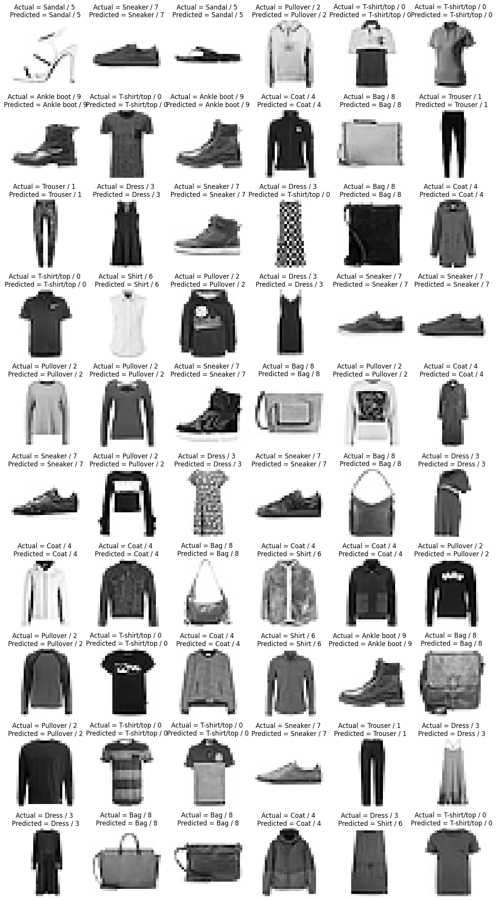
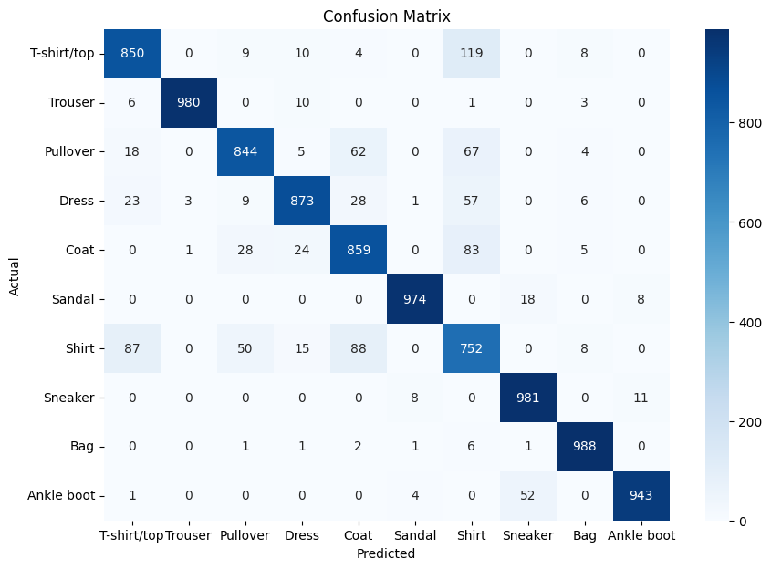

# 👕 Fashion MNIST CNN Classifier

This project implements a Convolutional Neural Network (CNN) to classify images from the Fashion MNIST dataset, which contains 70,000 grayscale images across 10 clothing categories (T-shirt/top, Trouser, Pullover, Dress, Coat, Sandal, Shirt, Sneaker, Bag, and Ankle boot).

✅ Results
Test Accuracy: 90.43%

Model: Custom CNN architecture with multiple convolutional, pooling, and dense layers.

Training Dataset: 60,000 images

Test Dataset: 10,000 images

📌 Key Observations
The model achieved a well-generalized performance across most categories.

A few misclassifications occurred due to:

Visual similarity (e.g., Shirt vs T-shirt/top, Coat vs Pullover)

Low resolution (28×28 pixels) and grayscale images

Some blurry or ambiguous samples

Despite these challenges, the model demonstrated strong classification ability with minimal confusion.

📂 Project Structure
```bash
├── model_training.ipynb     # Complete training notebook with evaluation
├── fashion_mnist_cnn_optimized_model.h5  # Final trained model
├── accuracy_plot.png        # Training vs validation accuracy plot
├── loss_plot.png            # Training vs validation loss plot
├── cm.png                   # Confusion matrix image
└── output.png               # Sample prediction outputs
```

📷 Example Predictions



📊 Confusion Matrix


